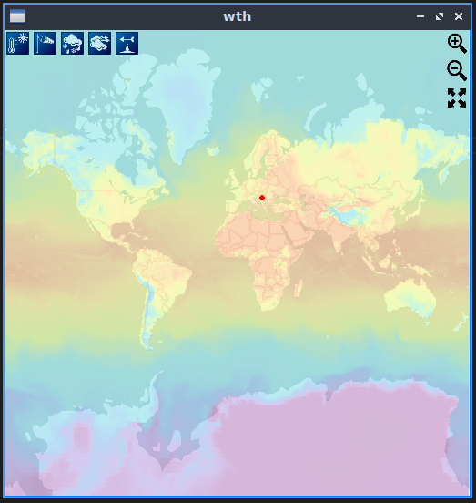
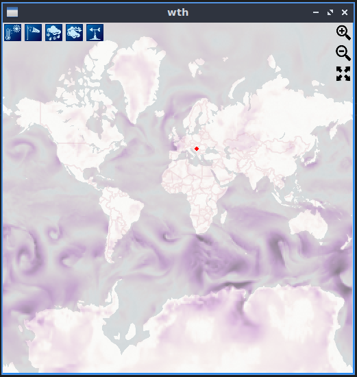
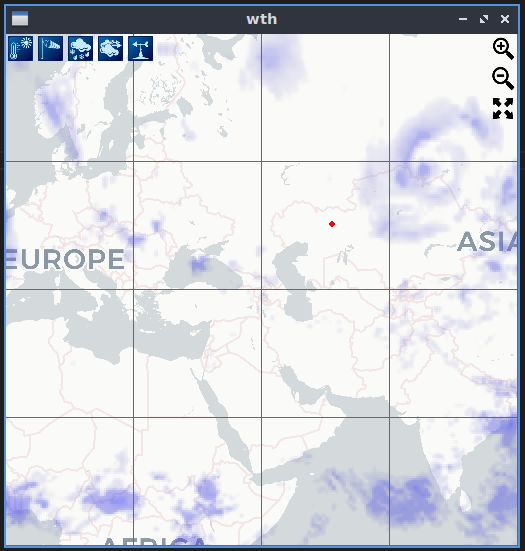
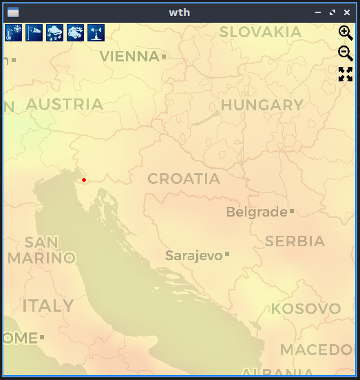

# Weather Tiles in Haskell

Functional Programming Course project that performs weather queries and visually displays the retrieved data. Written in Haskell using Gloss graphics library. Any similarities with existing abbreviations are totally coincidental!

Created by:
- [Ana Bajić](https://github.com/Pljosan/)
- [Ivan Ristović](https://github.com/ivan-ristovic/)
- [Strahinja Stanojević](https://github.com/filozof50/)

### What the hell is this? (no pun intended)

This is an application that uses open source APIs [OpenWeatherMap](https://openweathermap.org/api/weathermaps) and [CartoCDN](https://github.com/CartoDB/basemap-styles) to show weather information. These APIs return images in tiles, hence the title of this project.

The application is written **entirely** in Haskell using [Gloss](http://hackage.haskell.org/package/gloss).

